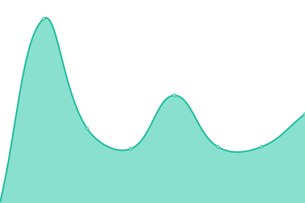
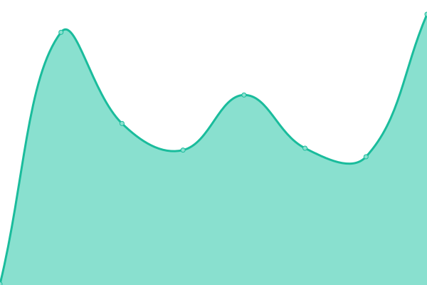
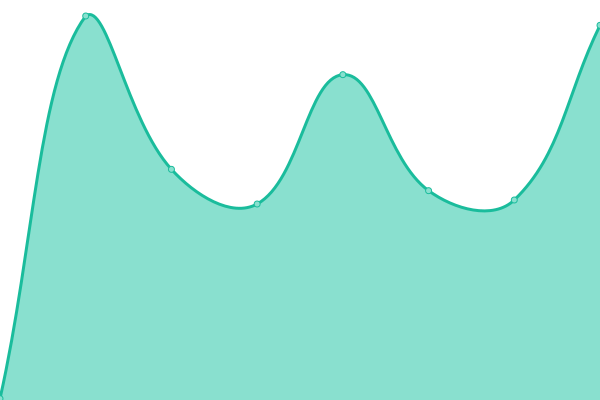
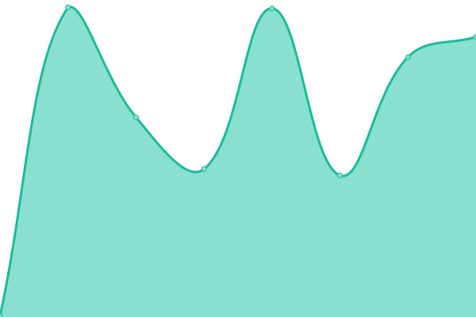

# [📈 Live Status](https://0ceanSlim.github.io/upptime): <!--live status--> **🟩 All systems operational**

This repository contains the open-source uptime monitor and status page for [OceanSlim](https://happytavern.co), powered by [Upptime](https://github.com/upptime/upptime).

With [Upptime](https://upptime.js.org), you can get your own unlimited and free uptime monitor and status page, powered entirely by a GitHub repository. We use [Issues](https://github.com/0ceanSlim/upptime/issues) as incident reports, [Actions](https://github.com/0ceanSlim/upptime/actions) as uptime monitors, and [Pages](https://0ceanSlim.github.io/upptime) for the status page.

<!--start: status pages-->
<!-- This summary is generated by Upptime (https://github.com/upptime/upptime) -->
<!-- Do not edit this manually, your changes will be overwritten -->
<!-- prettier-ignore -->
| URL | Status | History | Response Time | Uptime |
| --- | ------ | ------- | ------------- | ------ |
|  [Happy Tavern](https://happytavern.co) | 🟩 Up | [happy-tavern.yml](https://github.com/0ceanSlim/upptime/commits/HEAD/history/happy-tavern.yml) | 

 271ms
     
 | 

<a href="https://0ceanSlim.github.io/upptime/history/happy-tavern">99.81%</a>
    

|  [AudioBookshelf](https://books.happytavern.co) | 🟩 Up | [audio-bookshelf.yml](https://github.com/0ceanSlim/upptime/commits/HEAD/history/audio-bookshelf.yml) | 

 287ms
     
 | 

<a href="https://0ceanSlim.github.io/upptime/history/audio-bookshelf">99.27%</a>
    

|  [Mempool](https://mempool.happytavern.co) | 🟩 Up | [mempool.yml](https://github.com/0ceanSlim/upptime/commits/HEAD/history/mempool.yml) | 

 320ms
     
 | 

<a href="https://0ceanSlim.github.io/upptime/history/mempool">99.81%</a>
    

|  [DWM Game App](https://dwm.happytavern.co) | 🟩 Up | [dwm-game-app.yml](https://github.com/0ceanSlim/upptime/commits/HEAD/history/dwm-game-app.yml) | 

 252ms
     
 | 

<a href="https://0ceanSlim.github.io/upptime/history/dwm-game-app">99.81%</a>
    

|  [Nostr Hero](https://hero.happytavern.co) | 🟩 Up | [nostr-hero.yml](https://github.com/0ceanSlim/upptime/commits/HEAD/history/nostr-hero.yml) | 

 303ms
     
 | 

<a href="https://0ceanSlim.github.io/upptime/history/nostr-hero">99.81%</a>
    

|  [Wheat](https://wheat.happytavern.co) | 🟩 Up | [wheat.yml](https://github.com/0ceanSlim/upptime/commits/HEAD/history/wheat.yml) | 

 315ms
     
 | 

<a href="https://0ceanSlim.github.io/upptime/history/wheat">99.81%</a>
    

|  [Link](https://link.happytavern.co) | 🟩 Up | [link.yml](https://github.com/0ceanSlim/upptime/commits/HEAD/history/link.yml) | 

 467ms
     
 | 

<a href="https://0ceanSlim.github.io/upptime/history/link">99.81%</a>
    

<!--end: status pages-->

[**Visit our status website →**](https://0ceanSlim.github.io/upptime)

## 📄 License

- Powered by: [Upptime](https://github.com/upptime/upptime)
- Code: [MIT](./LICENSE) © [Anand Chowdhary](https://anandchowdhary.com), supported by [Pabio](https://pabio.com)
- Data in the `./history` directory: [Open Database License](https://opendatacommons.org/licenses/odbl/1-0/)
